<!-- Profile panels are local SVGs so the arcade theme renders on GitHub. -->

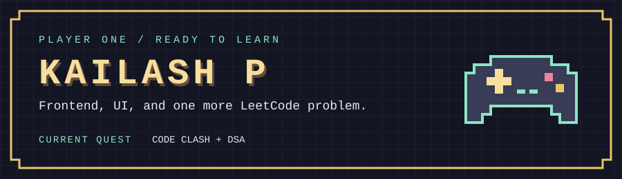
  
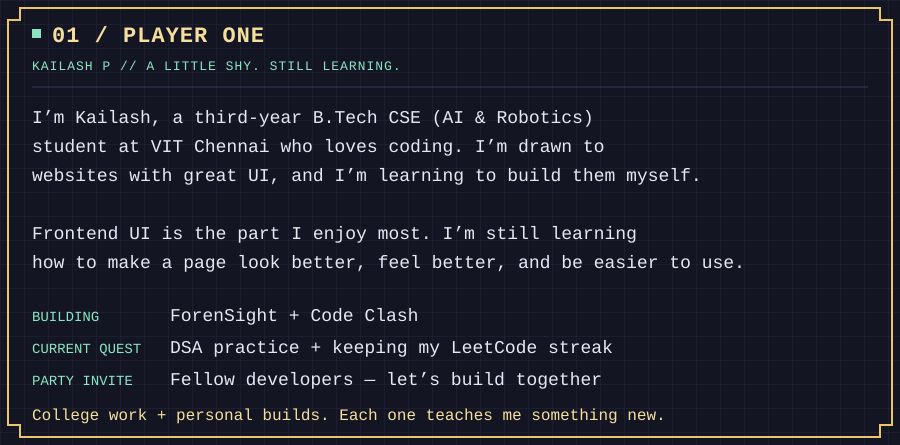
  
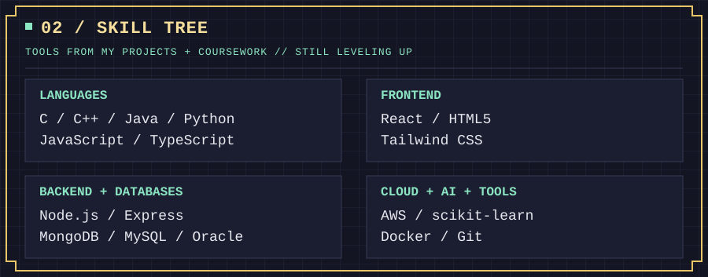
  
<a href="https://github.com/kailashp-27/Code-Clash">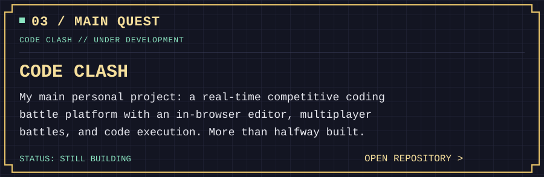</a>
  
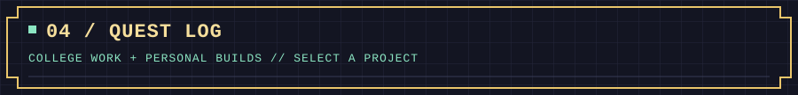
  
<a href="https://github.com/kailashp-27/EchoSphere">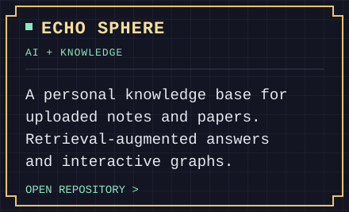</a>
<a href="https://github.com/kailashp-27/hoWrk">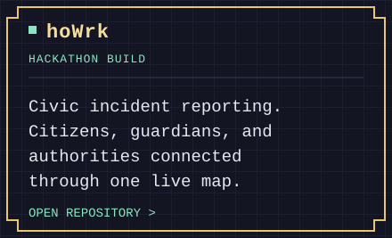</a>
 
<a href="https://github.com/kailashp-27/Audit-Pay">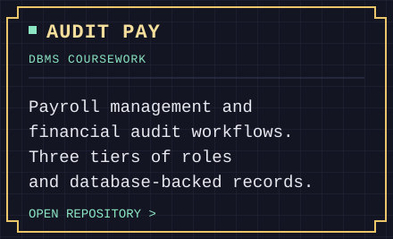</a>
<a href="https://github.com/kailashp-27/StrideLog">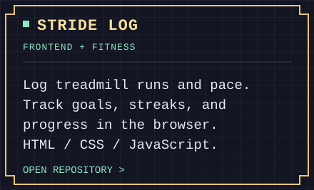</a>
  
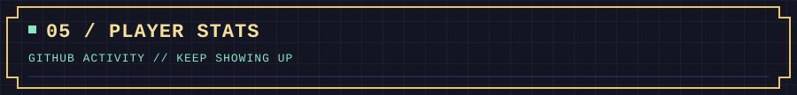
  

  

  
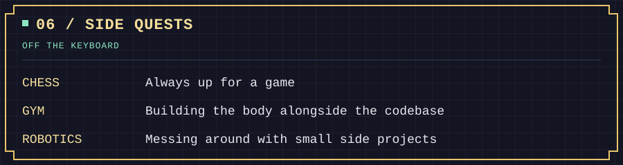
  
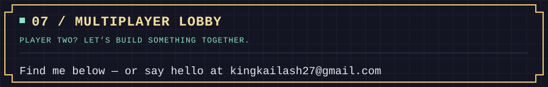
  

  

